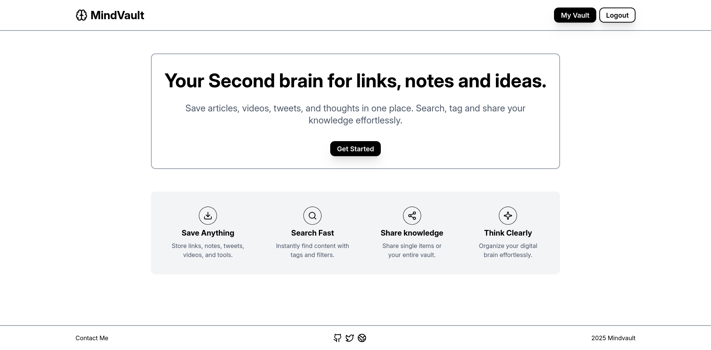
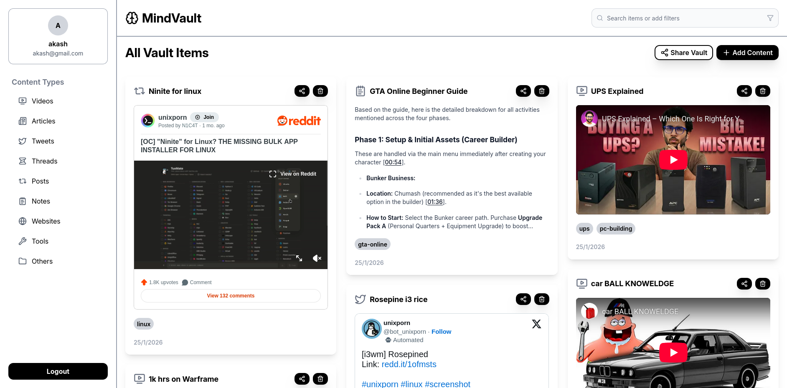
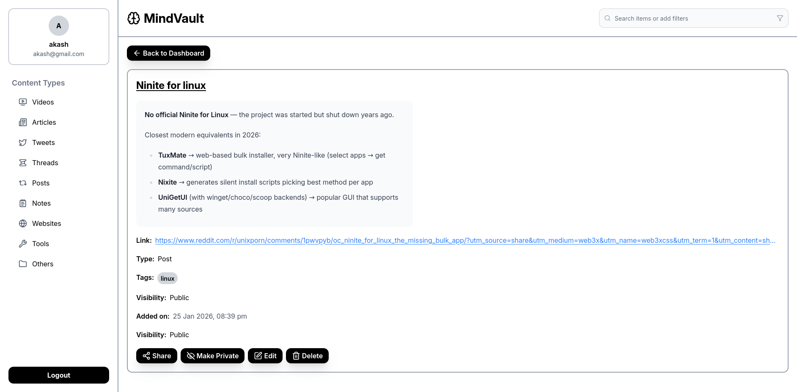

# MindVault

**Live Demo:** [https://mindvault-akash.vercel.app/](https://mindvault-akash.vercel.app/)

MindVault is a personal knowledge management app — your **second brain** for saving, organizing, and sharing links, notes, videos, tweets, and ideas in one place.
It helps you capture information effortlessly, retrieve it instantly, and keep your digital knowledge structured and searchable.

---

## Screenshots

### Home



### Dashboard / Vault



### Item Details



---

## Features

* Save content from multiple sources:

  * Articles
  * Videos
  * Tweets
  * Notes
  * Tools & websites
* Tag-based organization
* Search and filtering
* Public & private vault items
* Share individual items or the entire vault
* Clean, distraction-free UI
* Authentication with JWT
* Responsive design

---

## Tech Stack

**Frontend**

* React
* TypeScript
* Vite
* Tailwind CSS

**Backend**

* Node.js
* Express
* TypeScript
* MongoDB
* JWT Authentication

---

## Running Locally

### Prerequisites

* Node.js (v18+ recommended)
* MongoDB (local or Atlas)

---

### Backend Setup

```bash
cd backend
npm install
```

Create a `.env` file inside `backend/`:

```env
MONGO_URI=
JWT_SECRET=
CLIENT_URL="http://localhost:5173"
```

Run the backend:

```bash
npm run dev
```

Backend will start on its configured port (default: 3000).

```
http://localhost:3000
```

---

### Frontend Setup

```bash
cd frontend
npm install
npm run dev
```

Frontend will be available at:

```
http://localhost:5173
```

